# AdminSCH története

*Ez az oldal részletesebben kifejti az egyes elemeit a KSZK 50-es AdminSCH Története című előadásnak. Mikor az alapanyagokat gyűjtöttem, hamar rájöttem, hogy
egy 25 perces előadás nem lesz elég hogy mindent kiírjak. És ezért is alkotódott ez meg. Az oldalon a számokat mind a jelenlegi 74 elérhető
repo-ból generáltam ki. Ez összesen74 ember munkáját és 6245 commit-ot jelent 2013-tól napjainkig. (2026 Szeptember 9)*

---

## Rólam

Akkor magamról egy kicsit. Rafael Lászlónak, Lackónak hívnak. Én még 2018-ban kezdtem a KSZK-ban, majd az idő során sorban vettem fel a különböző kalapokat. Voltam a virtualizációs klaszterünk (VMWare) rendszergazdája, Devteam körvezető, a KSZK képzés többszöri főmentora, a konténerizációs (k8s) klaszterünk rendszergazdája és még egy rakat dolog. Aztán az utóbbi majdnem négy évben (2022 Augusztustól 2026 Május végéig) Dániában éltem. Először egy Google Cloud konzultációs pozícióban ([Devoteam](https://www.devoteam.com/)) dolgoztam. Majd 8 hónap után váltottam és onnantól három éven át egy sporttal foglalkozó cég infrastruktúráját és rendszereit kalapáltam ([Trackman](https://www.trackman.com/)). Három hónapja pedig újra itthon lakom és azóta a [Bitrise](https://bitrise.io/) nevű cégnél dolgozom.

Úgy ahogy sokan mások, én is a Schönherzbe beköltözve kezdtem a BME-n még 2018-ban. És hát fogalmam se volt a KSZK rendszereiről. Regisztráltam a Schacc-omat, bevittem a holmimat a szobámba, egyszer lementem UTP kábelt összerakni a KSZK-sokkal és ennyi volt az interakcióm. Talán egyszer panaszkodtam ticketben, hogy mennyire zavaró, hogy két eszközzel nem lehet ugyanazt az IP-t használni. De ennyi.

Aztán valahol tavasszal beszippantott a KSZK képzése és végül a nyár folyamán, immáron újoncként kezdtem el foglalkozni az AdminSCH projekttel. Bevallom, ekkor még nagyon alacsony volt a tudásom. Soha nem kódoltam hasonló weboldalt. De volt egy kis ismeretem és ez elég volt, hogy 2019 nyarán beüljek egy projektgyűlésre. Itt fogadott minket Kiss Tomi, Marcselló és Márki-zay Feri egy üres táblával. Mit ne mondjak, az előadásunk végére rendesen telerajzolták nekünk a táblát.

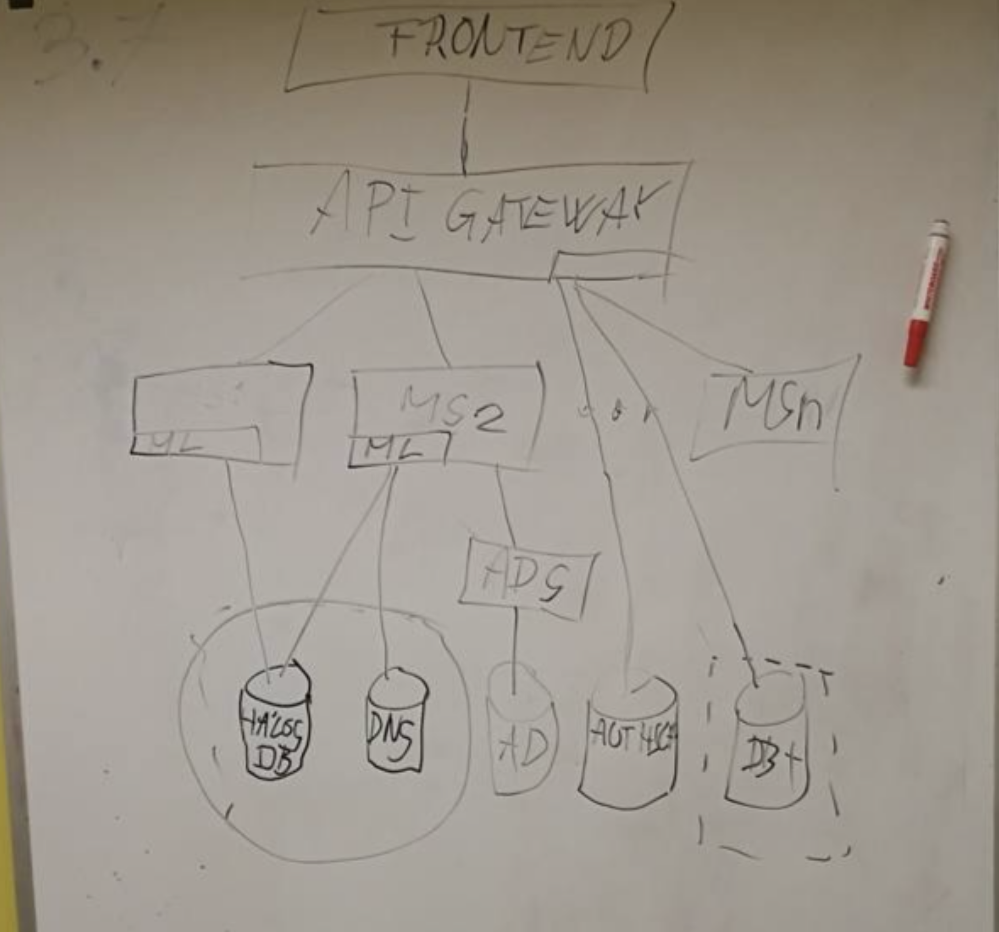
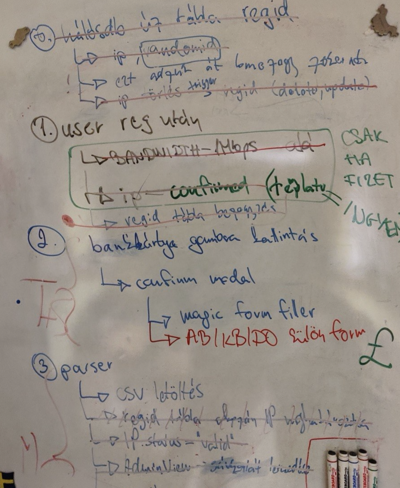

---

## Intro

Először is mi az a KSZK? Hát talán a [weboldalunkon](https://kszk.bme.hu/) megtalálható leírás írja le a legjobban:

> A Kollégiumi Számítástechnikai Kör a kar egyik első - jelenleg is aktív - öntevékeny csoportosulása, mely 1976-ban került megalapításra. Tagjaink az informatika különböző területei iránt kiemelten érdeklődő öntevékeny egyetemista hallgatók, akik tanulmányaikon túl, szabaidejükben fejlesztik magukat és rendszereinket, megkönnyítve ezzel a kollégisták, valamint a kar hallgatóinak hétköznapjait. Aktív tagjaink az iparban alkalmazott naprakész tudásra tesznek szert itt, kísérleteznek saját ötleteikkel és jó kapcsolatokat építenek ki ebben a jó hangulatú, alkotó kedvű közösségben.
> A KSZK tevékenysége két nagy területre bontható: az üzemeltetésre és a fejlesztésre. Előbbi esetén hálózattervezéssel, felügyelettel, monitorozással és különböző típusú szerverszolgáltatások üzemeltetésével foglalkozunk. Utóbbi esetén pedig a web-, mobil- és szoftverfejlesztés jön szóba, valamint tevékenységeink során az IT security-vel is behatóan foglalkozunk.

És mikor ezt olvasom az első gondolatom pont az, hogy mégis hogy tudja ezt egy kis csoport menedzselni? Hát igen, úgy, hogy mindent amit lehet megpróbálunk leautomatizálni. És pont itt jön be az AdminSCH. 

Te hogyan oldanád meg körülbelül 500 új diák regisztrációját, annak elbírálását és email fiók generálását? Milyen kihívásokra számítanál? Hogyan tennéd az egészet biztonságossá?

Aztán hogyan oldanád meg, hogy ezek az új felhasználók tudjanak internetezni a koli falain belül? Akár Wifin, akár a kábelen keresztül. Hogyan társítanál egy IP címet egy adott eszközhöz úgy, hogy azt a koliban lakók maguk meg tudják oldani? Hogyan oldanád meg, hogy akár 2-3 eszköz kényelmesen ellegyen egymás mellett a hálózaton?

Honnan tudom mégis, hogy egy diák amúgy a koliban lakik? Na és ha már internetet biztosítunk, hogyan vonjuk meg ezt valakitől, ha az internet szabályzattal szemben kihágást követ el?

És igen, az elmúlt 13 évben pont ezekre a kihívásokra és még sok másra adtunk választ.

És erről a történetről szeretnék beszélni. 

<!-- @stat-row -->
<!-- @hr -->
<!-- @md-only -->
**Számokban:** 6245 commit (merge nélkül), 74 repó, 74 közreműködő, 13 év git-történelem. A git történet csak 2013-ig nyúlik vissza — de maga a rendszer még ennél is korábbi.

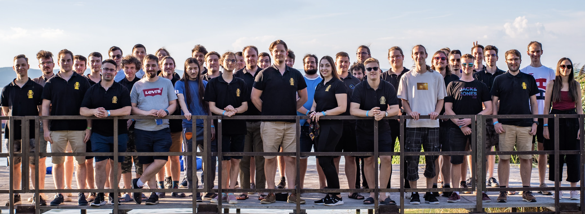

---

## Sztori és szakma

### Ugorjunk vissza — az idővonal

Mielőtt még nagyon beleugranánk a történetbe, nézzünk meg hol is helyezkedik el a fenti 74 repó. Hogy legyen apróbb képünk mibe is tekintünk bele. Itt láthatjuk az első commit-tól az utolsóig — indulás szerint rendezve, kategória szerint színezve. A szürke sávok már az archiváltak.

<!-- @chart id=timeline legend=timeline labels=true -->
<!-- @md-only -->
*(Interaktív verzióban: a repó-idővonal ábra, mind a 74 repó életciklusa.)*

### 2013 — amit örököltem

<!-- @year value=2013.1 --> 

Az, hogy a KSZK-sok feleljenek a hálózatért, már nagyon régen elindult. Akkor még egészen minimálisan volt automatizálva. Olyan legendákat is hallottam, hogy egy ponton fizikai papír formot kellett a beköltözőknek kitölteni, hogy kapjanak internetet.

A KSZK-nak már a 2000-es évek eleje óta volt egy admin-eszköze, „Admintools" néven — jóval a git előtt, arról nincs is commit-történelem, csak egy régi KSZK-s Youtube-videón látható még akcióban: [youtu.be/uL8Mxj5aKm8?t=268](https://youtu.be/uL8Mxj5aKm8?si=A2iu80lZ_b6GmINH&t=268). 

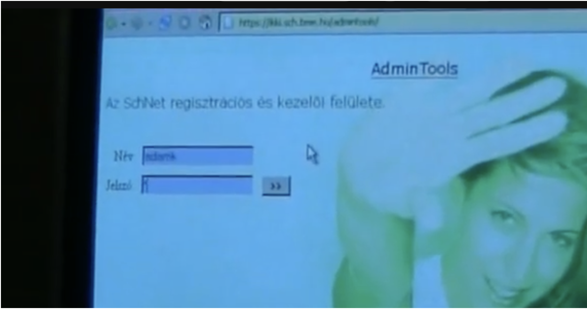

<!-- @year value=2010.1 --> 
Ezt követően aztán a 2010-es években már AdminSCH-ként referálhattunk rá. Arról nincs infóm hogy mi is volt a projekt neve, hol van giten vagy mit lehet megtalálni róla. De találtam egy [blogposztot 2012 Októberéből](https://kszk.bme.hu/articles/haloreg-2012-osz/#ett%C5%91l-a-f%C3%A9l%C3%A9vt%C5%91l-a-h%C3%A1l%C3%B3zatregisztr%C3%A1ci%C3%B3-menete-jelent%C5%91sen-megv%C3%A1ltozik-%C3%BAj-online-fel%C3%BCleten-ker%C3%BCl-lebonyol%C3%ADt%C3%A1sra) ahol már lehetséges volt a hálózati hozzájárulás befizetése.

<!-- @year value=2013.2 --> 
Egy biztos. Zolij **2013. február 11-én** fogta a teljes eddigi projektet, bemásolta egy git repo-ba, elcommitolta, majd továbbfejlesztette rengeteg funkcióval. Ő egykezüleg továbbvitte a projektet és én innentől beszélnék "AdminSCH"-ról, innentől van git története is. Szóval ha valaki kimaradt a commit history-ból vagy a statisztikákból, bátran dobja át az egykori git repo-t, már ha volt és felfrissítem az adatokat.

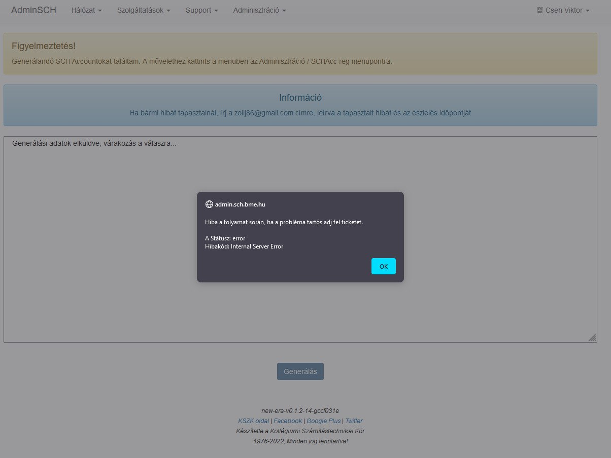

Zolij Adminsch-jának hívtuk, hiszen ő volt az, aki legfőbb emberként összerakta a fontos funkciókat. Ez egyébként egy mellékes projektje volt az egyetemi dolgai mellett, ugyanis ekkoriban írta az Authsch-t is szakdolgozatként. Nem csak írta — 2016 elejére be is fejezte: onnantól az Authsch adta a tagság-adatokat, ez lett az AdminSCH tényleges identitás-forrása. Kb. 1200 az 1369 commitból az `adminsch-old`-ban tőle van — **évekig gyakorlatilag egyedül vitte**. 1235 commit, 2013-tól 2018-ig, néhány kisebb megjelenéssel még 2019-ben is — sőt utoljára még 2021 novemberében is jóváhagyott egy pull requestet. Ez pontosan ugyanabban a nagyságrendben van, mint amennyit később Márki-Zay Feri (1064) vagy én magam (1249) tettünk bele a rendszerbe.

<!-- @year value=2013.3 --> 
Az első egy hónapja sokat elárul a régi Adminsch-nak: 2013. február 21. és március 10. között lerakta a teljes alapot — díjcsomagok az SQL-ből, színes beléptetők, szobaszám a FIR-ből, MAC-cím a hálós adatbázisból. Ugyanez a szobaszám–MAC–FIR hármas köszön vissza a mai Fir-service-ben is egyébként.

És igazából ezzel az oldallal először nem is volt baj. De aztán hamar kihullottak a csontvázak, és évekre előre rémálmot okozott többeknek a KSZK-ban. Viszont kiemelném, hogy az akkori ígéretét igenis beváltotta a rendszer, és elképesztően sok ötletet, megoldást emeltünk később át.

### 2015–2019 — az újraírási kísérletek

<!-- @year value=2015.1 --> 
Már 2015-ben, vagy még előbb elindult az igény, hogy átstrukturálják és újraírják. Kétszer meg is próbálták Zolij vezetése alatt — sikertelenül. Na de miért volt erre szükség?

Hát igazából mint minden újraíráskor, itt se volt már senki, aki tényleg átlátja, tudja fejleszteni és ráadásnak a kód se segített a helyzeten. Senki nem mert, és nem is akart hozzányúlni — meg lehet, az emberek úgy érezték, hogy tudnak jobbat összerakni.

<!-- @year value=2019.1 -->
Aztán egy napon jött a hír az egyetemtől: 2019-ben szeretnék, ha a fizetős rendszer beüzemelődne újra hálóregisztrációhoz. Igen már volt előtte, de itt valami változást kellett behozni. És hát a srácok sietve összedobtak egy új verziót. Úgy, hogy nem igazán értették a dolgokat — többen még akkor sose kódoltak ilyen mélyen PHP-ban, és sok megoldás lábon lövés volt inkább.

Csak hogy éreztessem, a commit history így néz ki ebből az időből.

<!-- @year value=2019.25 -->
<!-- @commit-log -->
> **„price on networkRegistration.php form final5”** — Madarász Bence, 2019. április 4.
>
> **„price on networkRegistration.php form final4”** — Madarász Bence, 2019. április 4.
>
> **„price on networkRegistration.php form final3”** — Madarász Bence, 2019. április 4.
>
> **„Merge remote-tracking branch 'origin/bmejegy' into bmejegy”** — Madarász Bence, 2019. április 4.
>
> **„price on networkRegistration.php form final2”** — Madarász Bence, 2019. április 4.

Egyszerűen lehetetlen volt a dolgokat jól tesztelni, folyton nyelvi hibákba futottunk és a kód struktúrája is nehezen átlátható volt. De nem is lehetett csak úgy eltörni, mert akkor megáll minden a koliban. 🔥 De így tényleg minden, semmi modularitás. És hát mikor találnak az emberek hibákat? Hát amikor legjobban kell. És mikor a legrosszabb ha eltöri valaki miközben próbálna valamit javítani? Hát igen, akkor mikor az embereknek kell...

De igazából én is csak rémtörténeteit hallottam ennek az időszaknak. Egy biztos, hogy valamit változtatni kellett és a srácok túl voltak terhelve.

### És akkor kanyarodjunk vissza

<!-- @year value=2018.9 -->
Mire én már megérkeztem, addigra egy egészen menő architektúrával drukkolt elő a csapat, és kellemes átállási tervet is készítettek. Igen, azért, ha már harmadjára próbál valamit újraírni egy csapat ember, akkor csak felkészültebbek. Persze nem volt tökéletes, de letette a mainak az alapjait. Vizsgáljuk is meg nagy vonalakban.

Ti hogyan szerveznétek át egy hatalmas rendszert úgy, hogy akár több generációnyi KSZK-s is tudja később fejleszteni, anélkül hogy átlátná az egészet vagy mindent újra kellene írnia? Hát, sok megoldás létezik, de mi a mikroszolgáltatásokra tettük le a voksunkat. És itt kiemelném Márki-zay Ferit, ugyanis nagy munkája volt ennek a megvalósításában. Ő rakta le a mikroszolgáltatás-alapú architektúra konkrét. Méghozzá így nézett ki az első iterációja:

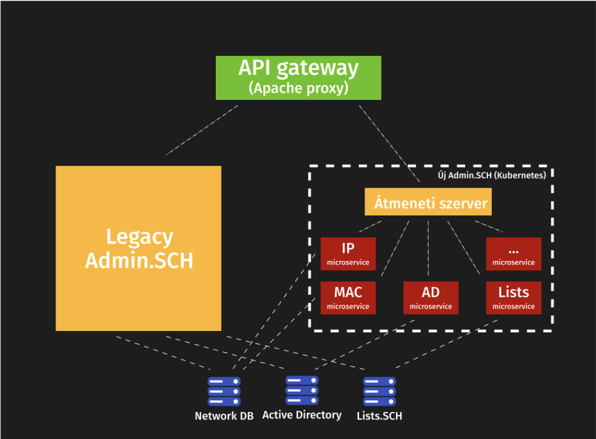

Ott bal oldalt volt egy nagy virtuális gépünk, amin futott a Legacy AdminSCH és egyébként ugyanitt ment a fenti zöld Apache proxy is. Ez a gép tele volt cronjobokkal amik PHP modulokat hívtak (például schacc regisztrációhoz), innen jöttek a levelek, ez hívott be igazából mindenhova. Végtelen olyan dolog, amit csak később fedeztünk fel igazán. Mikor ott hagytam a projektet, még ez a VM mindig megvolt mint mini proxy, mert az IP címe egyes helyekre benne volt a tűzfal szabályokban. :)

De úgy képzeljétek el, hogy például évi háromszor valakinek be kellett lépnie erre a gépre csak azért, hogy átírjon egy számot egy elrejtett fájlban, amivel megtudta mondani a weboldalnak, hogy éppen melyik félévben vagyunk. Sőt talán még az adatbázisban is kellett frissíteni különféle dátumokat, hogy jók legyenek a regisztrációs időszakok. :)

<!-- @year value=2019.9 -->
Aztán ott jobb oldalt volt az érdemi része a dolgoknak. Méghozzá amin mi dolgoztunk. Lényegében írtunk egy Python alapú átmeneti frontendet, ami egy az egyben ugyanúgy nézett ki mint a régi AdminSCH. Csak a funkcionalitást kiszervezte magából más service-ekbe. Tehát ha valaki lekérte a levelező lista tagságait akkor nem ez a python app kérte le közvetlen, hanem volt egy másik microservice amibe áthívott. Úgymond szimulálva amit egy frontend csinálna majd. És ez a logika mentén írtunk meg mindent.
Ez azért kellett hogy ugyanazt az élményt tudja megadni az oldal mint az egykori php megoldás.

Mire megérkeztem pont az első átállás folyt az új rendszerre és 2019 szeptemberére már aktívan ment a fenti megoldás. Ekkoriban sok frontend munkát kaptam Feritől. Aztán fokozatosan betanultam és egyre több munkát öltem a projektbe.
Egy cikket is írtunk a weboldalunkra erről: [kszk.bme.hu/articles/mi-az-a-microservice-ujrairtuk-az-admin-sch-t](https://kszk.bme.hu/articles/mi-az-a-microservice-ujrairtuk-az-admin-sch-t)

Feri ekkoriban gyakorlatilag mentorom volt a projektben — egyik fő hajtóereje annak, hogy egyáltalán bele mertem vágni. Állati sok hülye kérdést tettem fel neki, az biztos, de sosem éreztette.

### 2020–2021 — A projekt lassú halála

Na de nem volt kész egyáltalán. Nagyon sok funkció bent ragadt a legacy megoldásban és sok nyitott kérdés maradt.

<!-- @year value=2020.2 -->
2020 elején Feri aktívan dolgozott tovább a projekten. Ekkor rakta le szinte egyedül a reg-service alapjait, és — ami talán még fontosabb — a helm-charts/ci-templates devops-alapokat amit aztán később kibővítettem sok extrával. Ekkoriban továbbá Marcselló tökéletesítette mindhárom hálózati szinkronizáló szolgáltatásunk (DNS, RADIUS, DHCP). Kicsit hajtották magukat a srácok, rengeteg commitot tettek le ekkoriban többen is csak hogy minden rendben fusson.

Aztán 2020 Márciusa elérkezett, és a Covid fokozatosan megölte a projektet. Hirtelen mindenkinek átalakultak a prioritásai, a Schönherz koli egy káosz volt, többé nem kellett regisztrálni, nem kellett fizetni regért és sok speciális esetet kellett ellátni. És ez 2021 végéig így is maradt. Csak egy-két aktív fejlesztés volt már és úgy tünt hogy a projekt lassan csődbe fut.

Egyre gyakoribb kieséseink is voltak az infrastruktúra miatt, sok dolgot még mindig csak adatbázis-hívásokkal lehetett megoldani. De komolyan, azzal hogy "segédnetadmin"-ná váltál a KSZK-ban, kaptál egy hozzáférést a hálós adatbázishoz, ahol egyes mezőket tudtál átbillenteni a felhasználóknak. Egészen kellemetlen élmény volt és sok sebből vérzett. Ja és ha rossz parancsot adtál ki, akkor mindent is törölhettél könnyedén

<!-- @p class=stat-line -->
A commitszám ezt a kettősséget mutatja is — 2020-ban 727 commit, majd 2021-ben mindössze 92. Íme az egész 13 év, évenként:

<!-- @chart id=yearly -->

Új repók évről évre. Legalábbis amiket megtaláltam:

<!-- @chart id=repos -->

### 2021 — Akkor vége?

Lehet, hogy az AdminSCH projekt nem kapott fókuszt, de körülötte sorban javítottunk meg mindent. A hálózat megbízhatóbbá vált, a szervereinket átalakítottuk, új hardvereket szereztünk, a virtualizációnk jobbá vált, a Kubernetes klaszterünket megjavítottuk (később szakdolgozat témámmá is vált) és igazából egy nagyon prémium Devops Suite™ -et alakítottunk ki. Szimplán minden más volt előtérben.

2021-re már csak páran maradtunk. Még elvétve aktív voltam, néha commitoltam egy-egy-et az AdminSCH-ba és tartottam a kapcsolatot Ferivel. Aztán 2021 végén meg is bízott vele, hogy segítsek összerakni valami Frontend megoldást. Rajta is látszott hogy már le akarta zárni. Ekkoriban neki is álltam. Elkezdtem a különböző dolgok tesztelését, rengeteg kódot írtam és kihasználtam a vizsgaszünet adta extra időt januárban — és meg is találtam a szerintem jó irányt. 

<!-- @year value=2022.3 -->
De nem csak ez történt, ugyanis ekkor jött az ötlet Marcsellótól és Adriántól, hogy szervezzünk egy **KSZK hackathon**t. Hozzuk össze az embereket egy napnyi kódolásra. És úgy döntöttünk, hogy AdminSCH lesz a téma. Megkapta az **AdminSCH::Code** nevet. Méghozzá 2022 Február 5-étől másnap este 6-ig tartott volna az esemény, de elmaradt. De aztán végül sikerült leszervezni Március 19-ére. És ekkor raktam össze Ferivel közösen a DNS Service-t és még pár apróságot. Meglepően hatékonyak voltunk, viszont éreztük a nehézségeket.
Még mindig nem lehetett teljesen függetlenül dolgozni és nagyon kevés belső ismerete volt az embereknek. Ekkor szembesültem vele, hogy szükségünk van egy jó frontendre. Ha ez megvan, akkor innentől többé nem lesz egy központi AdminSCH kód (transient server) amit mindenkinek kötelező szerkesztenie, hanem teljesen függetlenül kódolhatunk majd. Sőt, ha sikerül átlátnom mindent, akkor még azzal is tudok segíteni hogy jól szétosszam a teendőket és az emberek ne fussanak egymás munkájába. 

Erre az alkalomra a Spot-ot is elhívtuk, hogy megörökítse a jövő számára: https://spot.sch.bme.hu/photo/2022/20220319_adminsch_code/

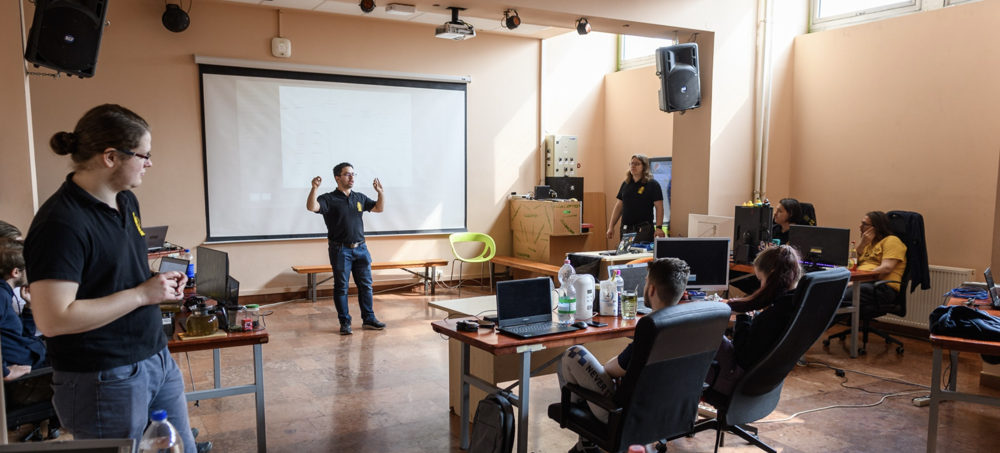

És ez az egész Hackathon egy hatalmas motivációt adott nekem a projektre. De hogyne adna, hiszen évek óta dolgoztam a többiekkel közösen AdminSCH körül mindenen és most láttam valamit ami minden eddigi munkánkat összefogja és elérhetővé teszi a Schönherz összes lakója számára. Végre nem az lesz a képe mindenkinek hogy mennyire használhatatlan és kidobott effort. Úgy éreztem, hogy nagyon közel vagyunk ahhoz, amit annó megálmodtunk. Innentől elkezdtem jobban beleásni magam, kipróbáltam dolgokat és összeraktam a React app kezdeti verzióját. Feri pedig a háttérből segített a backend service-ek átírásában, igazán JWT ready-vé tételével.

### 2022. június 25. — AdminSCH Code

<!-- @year value=2022.6 -->
Ekkoriban közben főmentor is voltam, és elárulom, hogy a képzés után nagyon beakartam mindenkit vonni. Az egész képzést úgy építettük fel, hogy a végén legyen egy alap rálátásuk. A képzést lezártuk a táborral, és meghírdettük Június 25-re az AdminSCH::Code-ot a Földszinti nagyterembe.

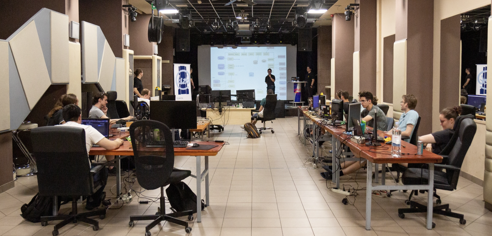

Többen is tartottunk aznap egy előadást és elindult a fejlesztés. *(Fotók: [spot.sch.bme.hu/photo/2022/20220625_adminsch_code](https://spot.sch.bme.hu/photo/2022/20220625_adminsch_code/))*

Mondhatni, jobb motiváció nincs is arra, mint igent mondani egy ilyenre, majd pedig hónapokon át az összes szabadidőd elégetni. De végül sikerült mindent időben előkészíteni, mindenki megjelent, az öregek biztosították a végtelen alkoholt és energia italt. És ekkor ott végre láttuk hol a vége, mit kell még lefejleszteni és megszülettek az első igazi diagrammok, prezentációk.

Ha megnézzük, ki mit épített azon a hétvégén. Gelencser Ákos (gelencser09) vitte a React-frontend-et (jogosultságok, navigáció, a teljes regisztrációs folyamat), Bence Orosz (woranhun) feltárta a regisztrációs folyamatot és ledokumentálta a jövő számára, pár Kotlinos nekifutása is volt. Pünkösd Marcell (Marcselló) egymaga megírta a workflow-service-t — az első commit-üzenete „Initial commit (it really is)", a többi pedig arról tanúskodik, hogy tényleg sárkányokkal küzdött közben („Fought dragons", majd „Cleaned up dead dragon bodies"). Horváth Zoli (Zoleee) pedig újraírta az email-service-t. Feri közben mélyen benne maradt a háttérben: a JWT-t és a license-service-t kötötte be az auth-service-be, és márciustól szeptemberig ő vitte tovább a backend gerincét, nem csak azon a hétvégén. 

A RabbitMQ-s hálózati automatizálás két lépésben állt össze: a reg-service már június 26-án, a hackathon hajrájában megkapta Feritől a RabbitMQ-integrációt, a vlan-service pedig csak október 18-án zárkózott fel hozzá — onnantól működött élesben a teljes lánc, amit fentebb leírtam.

A hackathon utáni hetek nem mentek zökkenőmentesen. A fir-service-t és a license-service-t is befejezte Kiss Tomi (thomasklein) utánna.

Vizsgáljuk is meg hogy hol álltunk ekkor — a hackathon utáni teljes architektúra, service-ről service-re szétszedve, funkció szerint csoportosítva:

- **Bejelentkezés & jogosultság:** Auth-service (saját DB: `adminsch_auth`) — Authsch mögötte
- **Regisztráció & hálózat:** Reg-service + AP-service (saját DB: `adminsch_reg` — szint, user, SSID, channel, MAC), VLAN-service (saját DB: `adminsch_vlan`, szinkron a DHCP Syncerrel a NOC-on)
- **Scraperek:** Fir-service (`adminsch_fir` ← Kefir), Pek-service kezdete (`adminsch_pek` ← Pék.sch), bme-net-filter-service (`adminsch_bmenet_filter` ← net.bme.hu/filter) — mind az Auth-service-nek jelent
- **Kommunikáció:** Email-service, Exchange-service, Sympa-service, Schacc-service kezdetlegesen (→ Mail.sch, Lists.sch)
- **Külső integrációk:** Windows-service (→ Active Directory), netwatcher-service (saját idősoros DB: InfluxDB, ← Netwatcher data provider), ipwave-service (↔ ipwave)
- **Admin felület:** Adminview-service (saját DB: `adminsch_adminview`, ← Adminview Syncer), React App — a Kubernetes Loadbalancer routolja: `/services/<name>` a megfelelő service-hez, `/` → React App
- **Egyéb szolgáltatás:** DNS-service + DNS-acme-service kezdeti (saját DB: `adminsch_dns`), I42-service (saját DB: `adminsch_i42`, a DNS-service-t használja), Workflow-service (saját DB: `adminsch_workflow`), License-service (saját: MongoDB), doc-service (még csak terv — async API)
- **Közös infrastruktúra:** RabbitMQ — üzenetsor, ez kötötte össze a service-eket egymással. Minden kérés URL alapján jutott a megfelelő service-hez, az azonosítás pedig mindenhol JWT-vel (JSON Web Token) történt

Amikor egyszer valaki megkérdezi, pontosan hogyan is jut internethez egy új lakó a kollégiumban — hát pont ez volt a kérdés, amit az elején feltettem. A válasz: regisztrálsz egy IP-t az AdminSCH felületén (fejenként 2 publikusat, akármennyi MAC-cel), ez eljut a reg-service-hez, ami konzultál a VLAN-service-el. Eközben fut egy Radius syncer és egy DHCP Syncer is a NOC-on, ami 2 percenként lekérdezi a friss adatokat, és feltölti velük a RADIUS, illetve a DHCP szervert. Amikor a géped csatlakozik, a switch a RADIUS-on keresztül lekérdezi, melyik VLAN-ba kell tennie a portot — ezt hívjuk Port Auth-nak —, utána jön egy sima DHCP kérés, és kapsz egy IP-t. Ha valaki nem kollégista, vagy nincs rá jogosultsága, azt a Fir- és Pék-service szűri ki előtte. Ilyen egyszerű — mondjuk két tucat service és pár év fejlesztés árán.

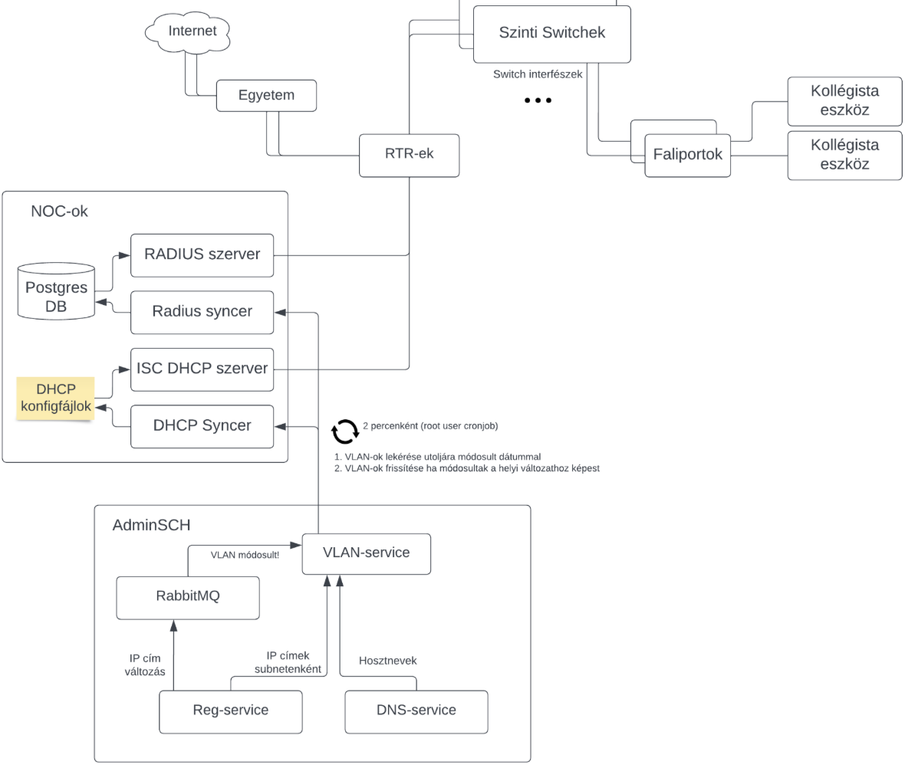

### 2022. Augusztus 1 - Az átállás

<!-- @year value=2022.8 -->
Már csak egy utolsó alkalom hiányzott, hogy igazán átállhassunk. Úgyhogy Július 30-ára leszerveztük a harmadik AdminSCH::Code-ot. Eddigre szinte mindent befejeztünk ami elég volt ahhoz, hogy átálljunk prodon. Nem volt egyáltalán tökéletes, de úgy éreztük, hogy meg kell tegyük ezt a lépést.

Majd pedig zsúfolt fejlesztések után Augusztus 1, este 1 óra 26 perckor átálltunk. Akkor ott tudtuk, hogy sok funkció még hiányzik, de egyben azt is éreztük, hogy most meg kell tegyük. Tudtuk, hogy rosszabb esetben tudunk gólyanaetet biztosítani, tudtuk hogy a szolgáltatások nagy részét még ha fájdalmasan is, de pár hónapig tudjuk manuálisan vinni. És ezt a rizikót bevállaltuk

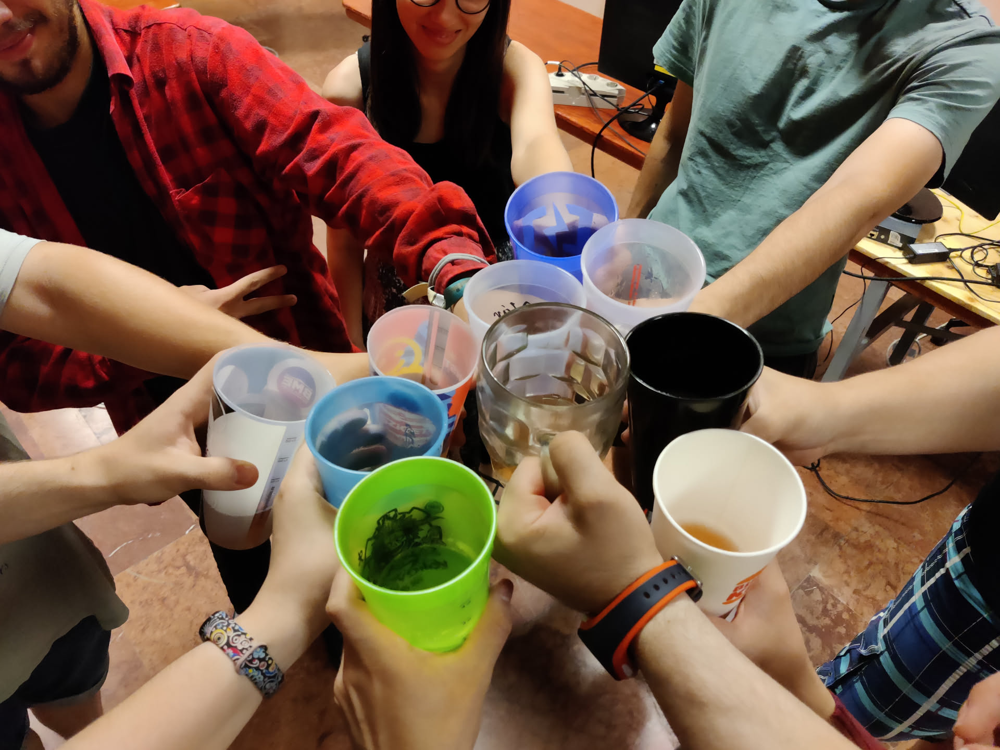

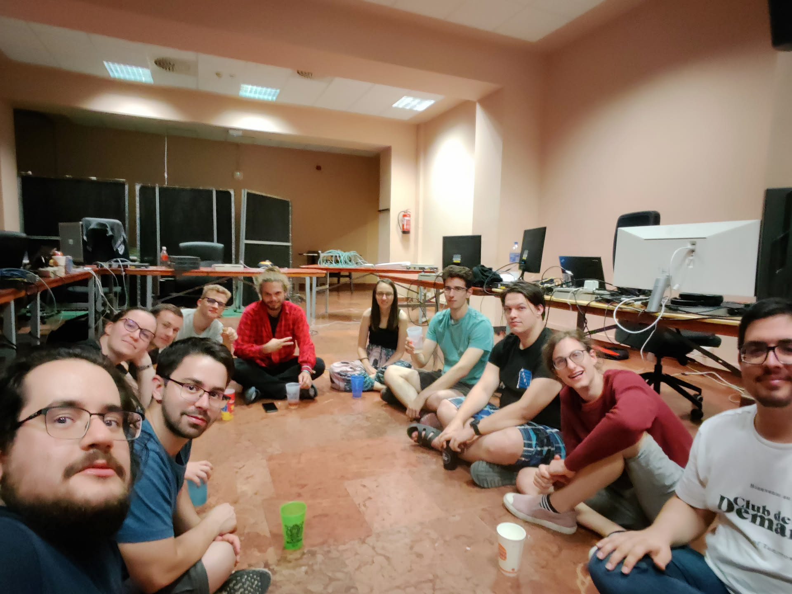

### 2022 második felétől 2023 végéig

AdminSCH::Code Vol.3 -tól kezdve nem pihentem egy két hónapig. Szinte minden nap dolgoztam valami hiba javításán vagy valami kimaradt funkció behozásán. Külön köszönet ekkor mindenkinek, Tominak és Ferinek főleg, sokat segítettek ekkor. 

Augusztus elején hogy több beletekintésem legyen a dolgokba, először összeraktam a `log-service`-t. Lényegében api-t adott ahova service-ek tudtak küldeni logokat. Például mikor elkészült egy reg vagy valaki interaktált valamivel.

Ezután összeraktam a Sentry-nket, bekötöttem hogy lássam mi is történik és a többiekkel közösen aktívan javítottuk a hibákat. Szeptember közepére sikeresen stabilizáltunk is mindent.

Aztán lelassultak a dolgok 2023 elejéig. Ekkor ugyanis nem tudom miért, de sokkal több szabadidőm lett és sorban átírtam a szolgáltatásokat, mindent is sztenderdizáltam. Valószínűleg ekkor már készültem az átadásra.
Befejeztem az `email-v3-service`-t, kihelyeztem élesbe. Összeraktam a `bmenet-filter-job`-ot, mely a BME-s sávkorlátozásokról
értesítette a kolisokat ha valamit átléptek. Ehhez az email service api-ját használta. Emellett összeraktam az `account-v2-service`-t mely megvalósított szinte mindent ami az Active Directory-val való interakcióhoz kellett. Az év végére
pedig összeraktam két dolgot. Egyrészt a `workflow-v2-service`-t ami már tudott kezelni egyes eseteket amik kimaradtak az
eredeti tervből. Továbbá a `b2b-app`-ot ami egy extra frontend volt kszk-soknak. Eddigre már kifáradtam és nem akartam a frontendhez sokat nyúlni. Úgyhogy behúztam egy kész React Admin nevű megoldást egyes csak API-ból elérhető dolgok kezeléséhez.

### 2024–2026 — a stafétabot

<!-- @year value=2023.1 -->
Megérkezett egy új generáció utánnunk. Pomucz Tomi és Wendl Lili vitte a legtöbbet, de rendszeresen dolgozott rajta Spyro, Szenes Márton Miklós, zsotroav (más néven Török Zsombor), Tóth Elíz, Tőrös András, Kiss Tomi és mások is.

Ezt a szakaszt már csak git-ből tudtam összerakni, de tovább finomodott minden — sőt, az egyik legrégebbi kihívásunk végre valódi megoldást kapott.

<!-- @year value=2024.62 -->
**2024 augusztusában** Kiss Tomi és Pomucz Tomi egy nagy, összehangolt munkával — a frontend, az auth-service, az account-v2-service, az email-v3-service és a workflow-v2-service egyszerre változott — nekiálltak annak, amit a legelső kihívásként feltettem az elején: **hogyan oldjuk meg 500 új diák önkiszolgált regisztrációját.** A funkció neve „schaccreg" lett — ez a név egyébként már 2022 óta ott lapult egy auth-service commit-üzenetben, csak korábban nem épült köré teljes önkiszolgáló folyamat. Még ők maguk is megjegyezték egy commitban, hogy a név félrevezető, és át kellett nevezni rendes regisztrációra. 2025-ben jött hozzá az impersonation-funkció (hogy egy KSZK-s a felhasználó nevében is végig tudja csinálni a folyamatot support céljából), 2026 augusztusában pedig még mindig csiszolgatják — legutóbb egy figyelmeztető üzenetet adtak hozzá gólyáknak. Végre meg lett a válasz.

Egy másik régi probléma is megoldódott: a NAT mögötti eszközök hálózati regisztrációja. Első nekifutás 2024 nyarán volt a reg-service-ben (`natreg` branch, Bence Orosz és Hunor Toth), kicsit döcögősen. A végleges megoldás 2026 januárjában született meg, `sch-natgw-sync` néven — Wendl Lili és Pomucz Tomi a NAT mögötti routerekkel beszélő szolgáltatást írtak, VRRP failover-állapottal és Prometheus-metrikákkal, és a munka a mai napig tart. Mellé zsotroav egy egész hibakereső felületet épített a frontendbe (hogy a felhasználók maguk tudják diagnosztizálni a hálózati gondjaikat), Tőrös András pedig a NAT-táblázat felületét alakította ki.

<!-- @year value=2025.6 -->
A `levlista-service` — nálunk ez a levelezőlista-kezelés (Google Groups és Microsoft Exchange disztribúciós listák szinkronban tartása), gyakorlatilag a régi Sympa-service utódja. Nem volt egyenes út: Spyro 2024 őszén nekiállt, majd egy ponton feladta — a commit-üzenete szó szerint „I give up, but i've written down what i know" —, aztán hét hónapig senki sem nyúlt hozzá. 2025 júliusában Spyro újra visszatért hozzá, majd az őszi hónapokban Szenes Márton Miklós vitte sokkal tovább, a saját `second-release`/`second-release-extra-features` branch-eivel — és a munka azóta is aktívan folyik.

<!-- @year value=2026.2 -->
2026 márciusában egy vadonatúj `notification-service` is született — Szenes Márton Miklós indította el, Spyro pedig napokon belül csatlakozott és lett a legaktívabb közreműködője. Egy generikus értesítő-rendszer ez API-kulcsokkal, feliratkozásokkal, email- és Discord-webhookos küldéssel, aminek egy része egy másik KSZK-s rendszerből, a „belepteto-sch"-ból lett újrahasznosítva.

De azért jó látni, hogy nem csak mi szenvedtünk annó a projekttel. Hanem a jelenlegi generáció is megközd vele. 2025 novemberében Tóth Elíz két egymást követő napon írta be a helm-charts repóba, hogy „I am losing my goddamn mind", majd „Added weight because kube is a lousy motherf*cker" — a Kubernetes-klaszter, amire az egész rendszer épül, néha 2025-ben is ugyanolyan makacs tudott lenni, mint 2020-ban:)

Szóval a történet nem állt meg 2023-ban, és nem is csak simán továbbfolyt.

## Architektúra

### Architektúra három állapotban

Ehhey még visszatérek. TODO:)

<!-- @chart id=category caption="73 mai repó, hat kategóriában" -->

<!-- @chart id=toprepos caption="Top 12 repó a nyers commit-szám szerint, a maradék 62 egy összesítő sávban" -->

### Mi épült mikor — dióhéjban

Ha valaki csak a funkciókra kíváncsi, íme az egész történet pár sorban:

- **2013–2018 (AdminSCH legacy):** Schacc-regisztráció, alap admin felület, kézi(bb) hálózati IP-MAC kiosztás — mind egyetlen PHP-kódbázisban
- **2019:** Python-alapú „transient” frontend a legacy fölé; az első igazi microservice-ek (`ip-service`, `mac-service`, `dns-service`, `reg-service`); Fizetős hálóregisztráció
- **2020:** csendben, kevesek által észrevéve megépül a reg-service, a vlan-service és a devops-alap (`helm-charts`/`ci-templates`) — 2021-ben áll meg tényleg minden
- **2022 (AdminSCH Code):** a nagy újraírás — React frontend, körülbelül két tucat önálló microservice, RabbitMQ üzenetsor, JWT-azonosítás mindenhol, Kubernetes-routing, RADIUS+DHCP hálózati automatika
- **2022 december:** második, kisebb workshop — a windows-service beolvad az account-service-be, Vite váltja a Create React App-ot
- **2023:** finomítás és a végleges átállás — lezárul a legacy PHP-rendszer, stabil a devops pipeline
- **2023–2026:** második nekifutás a 2022-es service-eknek (`email-v3`, `workflow-v2`); **schaccreg** — végre önkiszolgáló regisztráció; a NAT kezelése is megoldódik (`sch-natgw-sync`); `levlista-service` (levelezőlista-kezelés, döcögős újraindítással); vadonatúj `notification-service` és egy új generáció tovább viszi a fejlesztést.

### Amit archiváltunk

34 repó — a mai 73-ból közel a fele — mára archiválva van a GitLabon: vagy leváltotta őket valami, vagy megoldottuk máshogy a problémát, amire épültek. Ezek nem hibák, csak lezárt fejezetek.

A leglátványosabb csoport a 2019-es service-ek: `ap-service`, `ad-service`, `exchange-service`, `mac-service`, `ipwave-service`, `dhcp-service`, `ip-service`, `template-service` és a `transient-server`. Ezeket mind váltottuk a 2022-es munka során ahogy felfedeztünk dizájn hibákat.

A `halosdb-splitter` — A tool amivel Augusztus elsején átmigráltunk minden adatot prodon. Néhány hackathon-hétvégi ötlet meg sosem jutott túl a vázon: a `fir-syncer-job` és a `net-filter-service` egyetlen „initial commit” után abbamaradt, egy korai `filter-bmenet-service`-próbálkozás (PoC) helyett végül a ma is élő `bmenet-filter-service`/`bmenet-filter-job` lett a megoldás, az `adminview-mock-service` pedig abbamaradt.

A `license-service-kotlin` mellett volt egy Java-s testvérkísérlet is (`adminsch-security-java`) — öt commit, 2020 végén, aztán soha többé.

A többi archivált repó (`sympa-service`, `netwatcher-backend`, `reg-exporter`, `payment-reader`, `adminsch-models`, `adminsch-logging-python`, `maintenance-site`) egyszerűen befejeződött: megcsinálták, amire valók voltak, és nem igényeltek több munkát. 

---

## Fejlesztések és statisztikák

### Kezdeményezések időrendben

A teljes commit történeten végigmenve ezek a konkrét, névvel azonosítható kezdeményezések rajzolódnak ki az elmúlt 13 évben:

<!-- @event-cards legend=initiatives -->

### Release-történet

A puszta commit-számokon túl a git tag-ek is mesélnek: 46 repóban összesen 992 valódi verziójelölés van 2019 és 2026 között.

<!-- @chart id=releases caption="Kiadott git tag-ek száma évente, mind a 46 tag-elt repóban összesítve" -->

| Év | Kiadott tag-ek |
|---|---|
| 2019 | 105 |
| 2020 | 141 |
| 2021 | 12 |
| 2022 | 196 |
| 2023 | 183 |
| 2024 | 99 |
| 2025 | 95 |
| 2026* | 161 |

*(2026 részleges év)*

2019. augusztus 26-án Feri egyetlen „Prod CI" nevű commit-tel egyszerre kapcsolta be az automata verziózást 11 service-en (ad-, adminview-, ap-, auth-, dns-, exchange-, fir-, ip-, mac-, sympa-service és a transient-server) — innen az azonos napon felbukkanó rengeteg `v0.1` tag. A leghosszabb életű, folyamatosan tag-elt repó a `dns-service`: hét éven át, `v0.1`-től (2019-08-26) egészen `1.15.5`-ig (2026-07-18) sosem állt meg. A `react-app` viszont a legaktívabb: 158 tag négy év alatt.

2022. július 31-én négy szolgáltatás (`react-app`, `reg-service`, `vlan-service`, `license-service`) mind ugyanazon a napon kapta meg az első `1.0.0` jelölését — méghozzá pontosan aznap, amikor a `vlan-service-ng` néven futó párhuzamos újraírási kísérletet elvetették, és az eredeti `vlan-service` kapott helyette friss, FastAPI-alapú átírást: a hackathon utáni fejlesztés aznap érett meg egyszerre kiadható állapotra. (Aznap, a `dns-service` commit-üzenetem szerint: „Why do I hate myself?" — a release napja sem ment feszültség nélkül.)

Volt itt-ott egy kis emberi esetlegesség is: az `auth-service` `1.5.1-security-patch` tagje az egyetlen a 992 közül, aminek névvel jelzett oka is van, nem csak verziószáma; az `account-v2-service`-nél 2024 augusztusában egy elgépelt extra pont került a tag névbe (`1.3.0.-rc3`, `1.3.0.-rc4`) — két kiadáson át javítatlanul. És nem minden ág futott célba: a `helm-charts`-ban egy 2023 januári, `pls-work` nevű branch (rlacko egyetlen „fix" üzenetű commitja) és a react-app-beli, önbevallottan félkész `netwatcher-integration` branch (2022 márciusa, Schulcz Ferenc: „Half-ready netwatcher integration with broken charts") a mai napig ott lóg mergeletlenül.

<!-- @hr -->

### Kié volt a staféta

Commitok évente közreműködőnként, 2013-tól — a hét legaktívabb ember névvel, a maradék 67 fő egy összesített sávban (lentebb mindenki névvel is szerepel). Jól látszik, ahogy adja tovább egyik a másiknak: **Zolij → Márki-Zay Feri → én → Pomucz Tomi és Wendl Lili.** Mindig akad, aki átveszi, mire az előző csúcsa elhalványul.

<!-- @chart id=generations legend=gen -->

És ugyanez összesítve, ki mennyit tett hozzá a rendszerhez összesen.

<!-- @chart id=leaderboard -->

| Közreműködő | Összes commit |
|---|---:|
| Laszlo Rafael (én) | 1242 |
| zolij | 1235 |
| Márki-Zay Ferenc | 1064 |
| Pomucz Tamás | 477 |
| Wendl Lili | 296 |
| Bence Orosz | 255 |
| Tamas Kiss | 247 |
| Spyro | 150 |
| marcsello | 143 |
| Gelencser Ákos | 124 |
| zsotroav | 103 |
| Szenes Márton Miklós | 100 |
| Torma Kristóf | 98 |
| gombossb | 71 |
| Eliz | 52 |
| Sanya | 40 |
| Kalmár Balázs | 39 |
| Abonyi Bence | 36 |
| Muzsai László | 34 |
| Horváth Zoltán | 31 |
| Bodor Máté | 29 |
| Tőrös András | 21 |
| Gyimesi Norbert | 21 |
| Csaba Zamolyi | 18 |
| Benjamin Peter | 18 |
| Hunor Toth | 18 |
| Bendegúz Gyönki | 17 |
| zyxtron | 16 |
| tothadam | 15 |
| Adam Kovacs | 14 |
| Madarász Bence | 14 |
| Illés | 13 |
| Cseh Viktor | 13 |
| hunbalazs | 12 |
| Dániel Bakai | 10 |
| *36 további ember (fejenként 10 commit alatt)* | 124 |

A puszta commit-szám azt mondja meg, ki mennyit *dolgozott*. Nem mondja meg, mi lett a munkájából. De azért egy pár statisztika mindenki munkájából.

<!-- @loc-table -->

## Köszönet

Köszönet mindenkinek, aki valaha akár egyetlen sor kódot vagy bármi mást is hozzáadott ehhez a rendszerhez. Tényleg mindenkinek:

<!-- @thanks-wall -->
Abonyi Bence, Adam Kovacs, Adrián Robotka, Agócs Dániel, Anna Bajnok, arcter, Armin Zavada, Bakos Ádám, Bence Orosz, BenceGyurus, Bendegúz Gyönki, Benjamin Peter, benjoe, blint, Bodor Máté, Csaba Zamolyi, Cseh Viktor, Csókás Bence, d.bajnok, Dániel Bakai, Eck Balázs, Eckl Máté, Eliz, florafelalora, fodorpatrik2000, Fricska Kamilla, gabor, Gelencser Ákos, gombossb, gyeben, Gyimesi Norbert, György Kurucz, Horváth Zoltán, hunbalazs, Hunor Toth, Illés, Janega Zoltán (zolij), Kalmár Balázs, kozkbalzs23, László Mócsy, Madarász Bence, manko, Marcell Pünkösd, marcsello, Márki-Zay Ferenc, Muzsai László, peterbenjamin2000, Pomucz Tamás, radlaci97, Revolex, sadneutrino, Sanya, Sinkó Dániel, Spyro, Szenczy Balázs, Szenes Márton Miklós, Takács Gergő Tibor, Tamas Kiss, tamas722, Torma Kristóf, tothadam, tothgabor, Tőrös András, valkosch, Vikus, Várkonyi Kornél, Wendl Lili, zsotroav, zyxtron, Ónodi-Kiss Lili.

---
